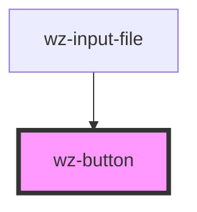

# wz-button

<!-- Auto Generated Below -->

## Properties

| Property      | Attribute     | Description | Type                              | Default     |
| ------------- | ------------- | ----------- | --------------------------------- | ----------- |
| `destructive` | `destructive` |             | `boolean`                         | `undefined` |
| `disabled`    | `disabled`    |             | `boolean`                         | `undefined` |
| `large`       | `large`       |             | `boolean`                         | `undefined` |
| `medium`      | `medium`      |             | `boolean`                         | `undefined` |
| `primary`     | `primary`     |             | `boolean`                         | `undefined` |
| `secondary`   | `secondary`   |             | `boolean`                         | `undefined` |
| `small`       | `small`       |             | `boolean`                         | `undefined` |
| `type`        | `type`        |             | `"button" \| "reset" \| "submit"` | `undefined` |

## Dependencies

### Used by

 - [wz-input-file](../inputfile)

### Graph

----------------------------------------------

*Built with [StencilJS](https://stenciljs.com/)*
