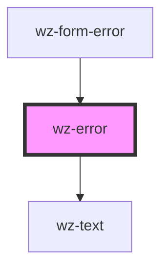

# wz-error

<!-- Auto Generated Below -->

## Dependencies

### Used by

 - [wz-form-error](../formerror)

### Depends on

- [wz-text](../text)

### Graph

----------------------------------------------

*Built with [StencilJS](https://stenciljs.com/)*
