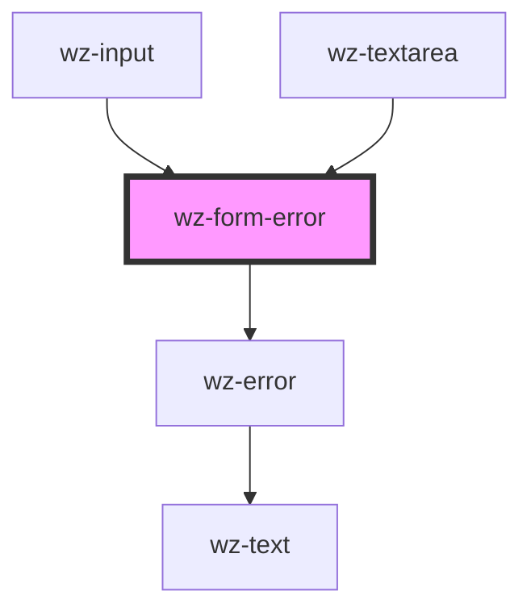

# wz-form-error

<!-- Auto Generated Below -->

## Properties

| Property | Attribute | Description | Type     | Default     |
| -------- | --------- | ----------- | -------- | ----------- |
| `error`  | `error`   |             | `string` | `undefined` |

## Dependencies

### Used by

 - [wz-input](../input)
 - [wz-textarea](../textarea)

### Depends on

- [wz-error](../error)

### Graph

----------------------------------------------

*Built with [StencilJS](https://stenciljs.com/)*
