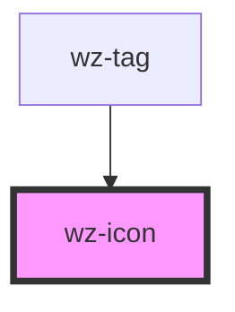

# wz-icon

<!-- Auto Generated Below -->

## Properties

| Property  | Attribute | Description | Type      | Default     |
| --------- | --------- | ----------- | --------- | ----------- |
| `color`   | `color`   |             | `string`  | `undefined` |
| `icon`    | `icon`    |             | `string`  | `undefined` |
| `large`   | `large`   |             | `boolean` | `undefined` |
| `medium`  | `medium`  |             | `boolean` | `undefined` |
| `small`   | `small`   |             | `boolean` | `undefined` |
| `xlarge`  | `xlarge`  |             | `boolean` | `undefined` |
| `xsmall`  | `xsmall`  |             | `boolean` | `undefined` |
| `xxsmall` | `xxsmall` |             | `boolean` | `undefined` |

## Dependencies

### Used by

 - [wz-tag](../tag)

### Graph

----------------------------------------------

*Built with [StencilJS](https://stenciljs.com/)*
