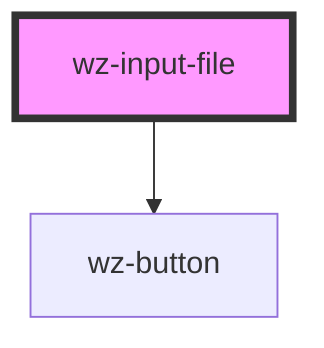

# wz-input-file

<!-- Auto Generated Below -->

## Properties

| Property      | Attribute     | Description | Type      | Default           |
| ------------- | ------------- | ----------- | --------- | ----------------- |
| `accept`      | `accept`      |             | `string`  | `undefined`       |
| `disabled`    | `disabled`    |             | `boolean` | `false`           |
| `name`        | `name`        |             | `string`  | `'file'`          |
| `placeholder` | `placeholder` |             | `string`  | `'Choose a file'` |

## Dependencies

### Depends on

- [wz-button](../button)

### Graph

----------------------------------------------

*Built with [StencilJS](https://stenciljs.com/)*
