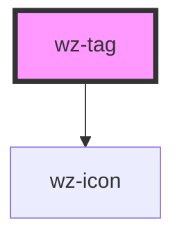

# wz-tag

<!-- Auto Generated Below -->

## Properties

| Property    | Attribute   | Description | Type      | Default     |
| ----------- | ----------- | ----------- | --------- | ----------- |
| `color`     | `color`     |             | `string`  | `undefined` |
| `icon`      | `icon`      |             | `string`  | `undefined` |
| `removable` | `removable` |             | `boolean` | `undefined` |

## Dependencies

### Depends on

- [wz-icon](../icon)

### Graph

----------------------------------------------

*Built with [StencilJS](https://stenciljs.com/)*
