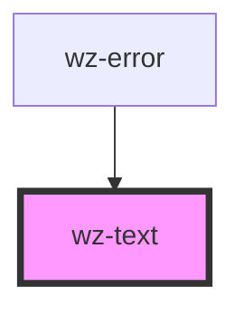

# wz-text

<!-- Auto Generated Below -->

## Properties

| Property   | Attribute  | Description | Type      | Default             |
| ---------- | ---------- | ----------- | --------- | ------------------- |
| `base`     | `base`     |             | `boolean` | `undefined`         |
| `bold`     | `bold`     |             | `boolean` | `undefined`         |
| `color`    | `color`    |             | `string`  | `'var(--ink-base)'` |
| `semibold` | `semibold` |             | `boolean` | `undefined`         |
| `small`    | `small`    |             | `boolean` | `undefined`         |

## Dependencies

### Used by

 - [wz-error](../error)

### Graph

----------------------------------------------

*Built with [StencilJS](https://stenciljs.com/)*
