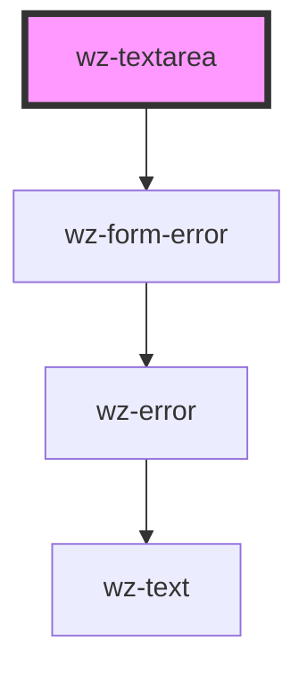

# wz-textarea

<!-- Auto Generated Below -->

## Properties

| Property      | Attribute     | Description | Type      | Default     |
| ------------- | ------------- | ----------- | --------- | ----------- |
| `disabled`    | `disabled`    |             | `boolean` | `undefined` |
| `error`       | `error`       |             | `string`  | `undefined` |
| `name`        | `name`        |             | `string`  | `undefined` |
| `placeholder` | `placeholder` |             | `string`  | `undefined` |
| `value`       | `value`       |             | `string`  | `undefined` |

## Dependencies

### Depends on

- [wz-form-error](../formerror)

### Graph

----------------------------------------------

*Built with [StencilJS](https://stenciljs.com/)*
